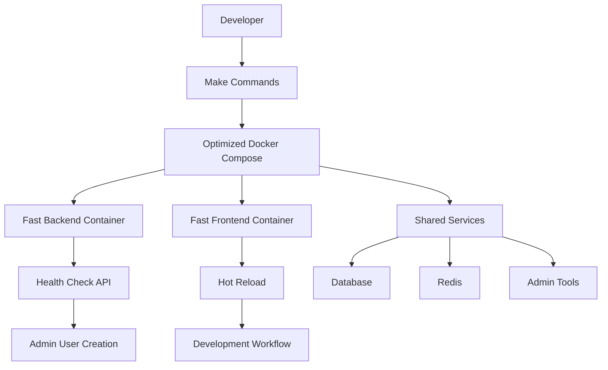
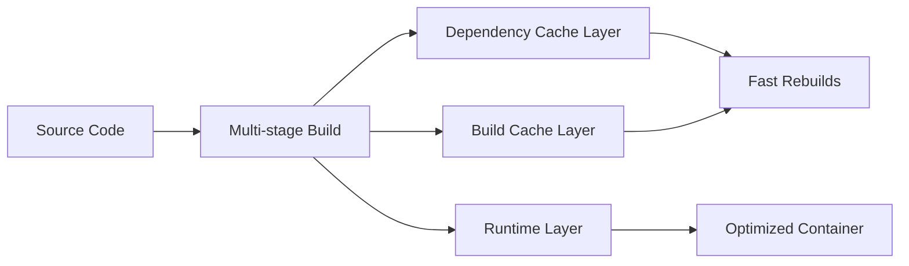

# Development Environment Optimization Design

## Overview

This design optimizes the Docker-based development environment for GarmentsERP by implementing multi-stage builds, improved health checks, efficient caching strategies, and streamlined development workflows. The solution focuses on reducing build times, improving reliability, and enhancing developer experience.

## Architecture

### Container Optimization Strategy



### Build Optimization Architecture



## Components and Interfaces

### 1. Optimized Dockerfile Structure

**Backend Dockerfile Improvements:**
- Multi-stage build with proper layer caching
- Separate dependency installation from source code copying
- Development-specific optimizations
- Proper health check endpoints

**Frontend Dockerfile Improvements:**
- Node.js dependency caching optimization
- Development server configuration
- Hot reload volume mounting
- Build artifact optimization

### 2. Enhanced Health Check System

**Health Check Endpoints:**
- `/api/health` - Basic service health
- `/api/health/ready` - Service readiness check
- `/api/health/live` - Liveness probe

**Health Check Implementation:**
- Proper HTTP status codes
- Dependency verification (database, Redis)
- Timeout and retry configuration
- Detailed error reporting

### 3. Development Workflow Tools

**Make Command Enhancements:**
- `make dev-status` - Check all service status
- `make dev-logs` - View aggregated logs
- `make dev-reset` - Clean restart all services
- `make admin-create` - Reliable admin user creation

### 4. Container Communication

**Service Discovery:**
- Internal Docker network communication
- Proper service naming and DNS resolution
- Environment variable configuration
- Port mapping optimization

## Data Models

### Health Check Response Model
```typescript
interface HealthCheckResponse {
  status: 'healthy' | 'unhealthy' | 'starting';
  timestamp: string;
  services: {
    database: ServiceStatus;
    redis: ServiceStatus;
    api: ServiceStatus;
  };
  details?: string;
}

interface ServiceStatus {
  status: 'up' | 'down' | 'starting';
  responseTime?: number;
  error?: string;
}
```

### Container Configuration Model
```yaml
# Optimized service configuration structure
services:
  backend:
    build:
      context: ./backend
      dockerfile: Dockerfile.dev
      cache_from:
        - backend-deps
        - backend-build
    environment:
      - ASPNETCORE_ENVIRONMENT=Development
    healthcheck:
      test: ["CMD", "curl", "-f", "http://localhost:8080/api/health/ready"]
      interval: 10s
      timeout: 5s
      retries: 3
      start_period: 30s
```

## Error Handling

### Build Error Recovery
- Clear error messages for common build failures
- Automatic retry mechanisms for transient failures
- Fallback strategies for network issues
- Build cache invalidation when needed

### Runtime Error Handling
- Service dependency management
- Graceful degradation when services are unavailable
- Automatic service restart policies
- Error logging and monitoring

### Health Check Error Handling
- Progressive health check intervals
- Service-specific error reporting
- Dependency chain validation
- Recovery recommendations

## Testing Strategy

### Container Testing
- Health check endpoint testing
- Service integration testing
- Build process validation
- Performance benchmarking

### Development Workflow Testing
- Make command functionality testing
- Admin user creation testing
- Hot reload verification
- Service communication testing

### Performance Testing
- Container startup time measurement
- Build time optimization validation
- Resource usage monitoring
- Load testing for development services

## Implementation Phases

### Phase 1: Health Check Optimization
- Implement proper health check endpoints
- Fix container health check commands
- Add service dependency validation
- Improve error reporting

### Phase 2: Build Process Optimization
- Optimize Dockerfile layer caching
- Implement multi-stage builds
- Add build performance monitoring
- Create build troubleshooting guides

### Phase 3: Development Workflow Enhancement
- Add comprehensive Make commands
- Implement service status monitoring
- Create admin user creation workflow
- Add development environment documentation

### Phase 4: Performance and Monitoring
- Add performance metrics collection
- Implement automated testing
- Create monitoring dashboards
- Optimize resource usage

## Configuration Management

### Environment Variables
- Centralized configuration management
- Environment-specific overrides
- Secure secret handling
- Configuration validation

### Docker Compose Optimization
- Service dependency ordering
- Volume mount optimization
- Network configuration
- Resource limit management

## Security Considerations

### Development Security
- Secure default configurations
- Network isolation
- Secret management
- Access control for admin interfaces

### Container Security
- Non-root user execution
- Minimal base images
- Security scanning integration
- Vulnerability management