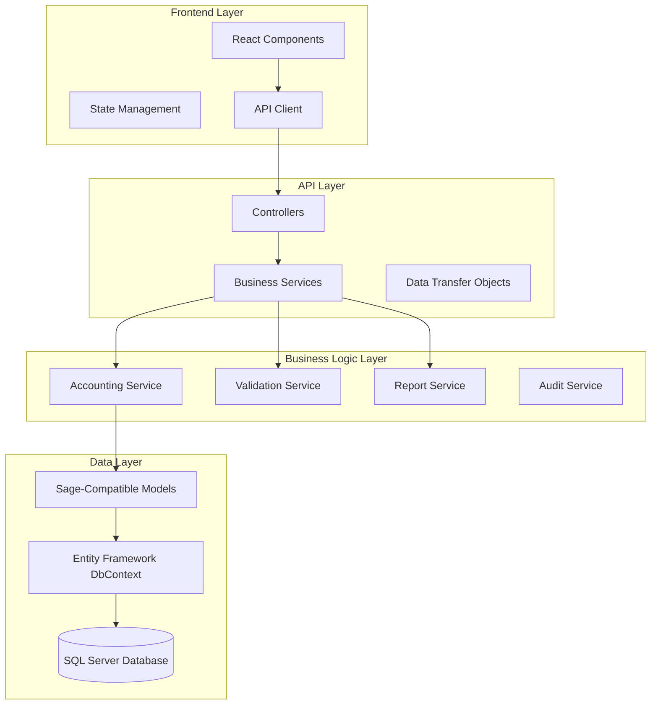

# Design Document

## Overview

The Enhanced Dynamic Accounting System builds upon the existing MM Fashion cash book implementation to provide a comprehensive, user-friendly accounting solution. The design leverages existing Sage-compatible models while adding dynamic category management, enhanced UI components, and robust reporting capabilities. The system maintains strict double-entry bookkeeping principles while providing the flexibility needed for modern business operations.

## Architecture

### System Architecture Overview



### Technology Stack

- **Frontend**: React 18+ with TypeScript, Material-UI v5, React Query for state management
- **Backend**: ASP.NET Core 8, Entity Framework Core 8
- **Database**: SQL Server with existing Sage-compatible schema
- **Reporting**: Custom PDF generation with A4 formatting support
- **Authentication**: JWT-based authentication with role-based access control

## Components and Interfaces

### Frontend Components Architecture

```
src/
├── components/
│   ├── accounting/
│   │   ├── CategoryManagement/
│   │   │   ├── CategoryList.tsx
│   │   │   ├── CategoryForm.tsx
│   │   │   ├── CategoryHierarchy.tsx
│   │   │   └── CategoryValidation.tsx
│   │   ├── ContactManagement/
│   │   │   ├── SupplierList.tsx
│   │   │   ├── BuyerList.tsx
│   │   │   ├── ContactForm.tsx
│   │   │   └── ContactAssignment.tsx
│   │   ├── CashBookEntry/
│   │   │   ├── EnhancedCashBookEntry.tsx
│   │   │   ├── CreditTransactionPanel.tsx
│   │   │   ├── DebitTransactionPanel.tsx
│   │   │   ├── BalanceValidator.tsx
│   │   │   └── TransactionSummary.tsx
│   │   ├── TrialBalance/
│   │   │   ├── TrialBalanceReport.tsx
│   │   │   ├── MonthSelector.tsx
│   │   │   ├── PrintableTrialBalance.tsx
│   │   │   └── TrialBalanceExport.tsx
│   │   └── Ledger/
│   │       ├── AccountLedger.tsx
│   │       ├── LedgerEntry.tsx
│   │       └── RunningBalance.tsx
│   ├── common/
│   │   ├── AutoComplete/
│   │   ├── DatePicker/
│   │   ├── CurrencyInput/
│   │   └── ValidationMessage/
│   └── layout/
│       ├── AccountingLayout.tsx
│       └── PrintLayout.tsx
```

### Backend Services Architecture

```
Services/
├── Accounting/
│   ├── IAccountingService.cs
│   ├── AccountingService.cs
│   ├── ICategoryService.cs
│   ├── CategoryService.cs
│   ├── IContactService.cs
│   ├── ContactService.cs
│   ├── ITrialBalanceService.cs
│   ├── TrialBalanceService.cs
│   └── ILedgerService.cs
├── Validation/
│   ├── ITransactionValidator.cs
│   ├── TransactionValidator.cs
│   ├── IBalanceValidator.cs
│   └── BalanceValidator.cs
├── Reporting/
│   ├── IReportService.cs
│   ├── ReportService.cs
│   ├── IPdfGenerator.cs
│   └── PdfGenerator.cs
└── Audit/
    ├── IAuditService.cs
    └── AuditService.cs
```

### API Controllers

```csharp
// Enhanced Controllers with Full CRUD Operations
[Route("api/[controller]")]
public class CategoryController : ControllerBase
{
    // CREATE
    [HttpPost]
    public async Task<IActionResult> CreateCategory(CreateCategoryDto categoryDto);
    
    // READ
    [HttpGet]
    public async Task<IActionResult> GetAllCategories(); // Get all categories with hierarchy
    
    [HttpGet("{id}")]
    public async Task<IActionResult> GetCategoryById(Guid id); // Get single category
    
    [HttpGet("hierarchy")]
    public async Task<IActionResult> GetCategoryHierarchy(); // Get hierarchical tree structure
    
    [HttpGet("{id}/transactions")]
    public async Task<IActionResult> GetCategoryTransactions(Guid id); // Get category transactions
    
    [HttpGet("search")]
    public async Task<IActionResult> SearchCategories(string searchTerm); // Search categories
    
    // UPDATE
    [HttpPut("{id}")]
    public async Task<IActionResult> UpdateCategory(Guid id, UpdateCategoryDto categoryDto);
    
    [HttpPatch("{id}/activate")]
    public async Task<IActionResult> ActivateCategory(Guid id); // Activate category
    
    [HttpPatch("{id}/deactivate")]
    public async Task<IActionResult> DeactivateCategory(Guid id); // Deactivate category
    
    // DELETE
    [HttpDelete("{id}")]
    public async Task<IActionResult> DeleteCategory(Guid id); // Soft delete category
    
    [HttpDelete("{id}/hard")]
    public async Task<IActionResult> HardDeleteCategory(Guid id); // Hard delete (admin only)
}

[Route("api/[controller]")]
public class ContactController : ControllerBase
{
    // CREATE
    [HttpPost]
    public async Task<IActionResult> CreateContact(CreateContactDto contactDto);
    
    [HttpPost("{id}/assign-category")]
    public async Task<IActionResult> AssignContactToCategory(Guid id, AssignCategoryDto assignDto);
    
    // READ
    [HttpGet]
    public async Task<IActionResult> GetAllContacts(); // Get all contacts
    
    [HttpGet("{id}")]
    public async Task<IActionResult> GetContactById(Guid id); // Get single contact
    
    [HttpGet("suppliers")]
    public async Task<IActionResult> GetAllSuppliers(); // Get all suppliers
    
    [HttpGet("buyers")]
    public async Task<IActionResult> GetAllBuyers(); // Get all buyers
    
    [HttpGet("{id}/categories")]
    public async Task<IActionResult> GetContactCategories(Guid id); // Get assigned categories
    
    [HttpGet("search")]
    public async Task<IActionResult> SearchContacts(string searchTerm); // Search contacts
    
    // UPDATE
    [HttpPut("{id}")]
    public async Task<IActionResult> UpdateContact(Guid id, UpdateContactDto contactDto);
    
    [HttpPatch("{id}/activate")]
    public async Task<IActionResult> ActivateContact(Guid id); // Activate contact
    
    [HttpPatch("{id}/deactivate")]
    public async Task<IActionResult> DeactivateContact(Guid id); // Deactivate contact
    
    // DELETE
    [HttpDelete("{id}")]
    public async Task<IActionResult> DeleteContact(Guid id); // Soft delete contact
    
    [HttpDelete("{id}/category/{categoryId}")]
    public async Task<IActionResult> RemoveContactFromCategory(Guid id, Guid categoryId); // Remove category assignment
}

[Route("api/[controller]")]
public class EnhancedCashBookController : ControllerBase
{
    // CREATE
    [HttpPost("entry")]
    public async Task<IActionResult> CreateCashBookEntry(CreateCashBookEntryDto entryDto);
    
    [HttpPost("entry/draft")]
    public async Task<IActionResult> SaveDraftEntry(CreateCashBookEntryDto entryDto); // Save as draft
    
    // READ
    [HttpGet("entries")]
    public async Task<IActionResult> GetAllEntries(int page = 1, int pageSize = 50); // Get all entries with pagination
    
    [HttpGet("entry/{id}")]
    public async Task<IActionResult> GetEntryById(Guid id); // Get single entry details
    
    [HttpGet("entries/date-range")]
    public async Task<IActionResult> GetEntriesByDateRange(DateTime startDate, DateTime endDate); // Get entries by date range
    
    [HttpGet("entries/status/{status}")]
    public async Task<IActionResult> GetEntriesByStatus(TransactionStatus status); // Get entries by status
    
    [HttpGet("entries/search")]
    public async Task<IActionResult> SearchEntries(string searchTerm); // Search entries
    
    [HttpGet("autocomplete/categories")]
    public async Task<IActionResult> GetCategoryAutoComplete(string term); // Category suggestions
    
    [HttpGet("autocomplete/contacts")]
    public async Task<IActionResult> GetContactAutoComplete(string term, ContactType? type = null); // Contact suggestions
    
    // UPDATE
    [HttpPut("entry/{id}")]
    public async Task<IActionResult> UpdateCashBookEntry(Guid id, UpdateCashBookEntryDto entryDto);
    
    [HttpPatch("entry/{id}/complete")]
    public async Task<IActionResult> CompleteEntry(Guid id); // Mark as completed (immutable)
    
    [HttpPatch("entry/{id}/approve")]
    public async Task<IActionResult> ApproveEntry(Guid id); // Approve entry
    
    [HttpPatch("entry/{id}/reject")]
    public async Task<IActionResult> RejectEntry(Guid id, string reason); // Reject entry
    
    // DELETE
    [HttpDelete("entry/{id}")]
    public async Task<IActionResult> DeleteEntry(Guid id); // Soft delete (only if not completed)
    
    [HttpPost("entry/{id}/reverse")]
    public async Task<IActionResult> ReverseEntry(Guid id, string reason); // Create reversing entry
}

[Route("api/[controller]")]
public class TrialBalanceController : ControllerBase
{
    // CREATE/GENERATE
    [HttpPost("generate/{year}/{month}")]
    public async Task<IActionResult> GenerateTrialBalance(int year, int month); // Generate and save trial balance
    
    [HttpPost("generate/current")]
    public async Task<IActionResult> GenerateCurrentMonthTrialBalance(); // Generate for current month
    
    // READ
    [HttpGet("{year}/{month}")]
    public async Task<IActionResult> GetTrialBalance(int year, int month); // Get trial balance data
    
    [HttpGet("history")]
    public async Task<IActionResult> GetTrialBalanceHistory(int page = 1, int pageSize = 12); // Get historical trial balances
    
    [HttpGet("{year}/{month}/details")]
    public async Task<IActionResult> GetTrialBalanceDetails(int year, int month); // Get detailed breakdown
    
    [HttpGet("{year}/{month}/pdf")]
    public async Task<IActionResult> GetTrialBalancePdf(int year, int month); // Generate PDF for printing
    
    [HttpGet("{year}/{month}/excel")]
    public async Task<IActionResult> GetTrialBalanceExcel(int year, int month); // Generate Excel export
    
    [HttpGet("compare/{year1}/{month1}/{year2}/{month2}")]
    public async Task<IActionResult> CompareTrialBalances(int year1, int month1, int year2, int month2); // Compare two periods
    
    // UPDATE
    [HttpPut("{year}/{month}/notes")]
    public async Task<IActionResult> UpdateTrialBalanceNotes(int year, int month, string notes); // Add notes to trial balance
    
    [HttpPatch("{year}/{month}/approve")]
    public async Task<IActionResult> ApproveTrialBalance(int year, int month); // Approve trial balance
    
    // DELETE
    [HttpDelete("{year}/{month}")]
    public async Task<IActionResult> DeleteTrialBalance(int year, int month); // Delete trial balance (admin only)
}

[Route("api/[controller]")]
public class LedgerController : ControllerBase
{
    // READ - Account Ledgers
    [HttpGet("account/{accountId}")]
    public async Task<IActionResult> GetAccountLedger(Guid accountId, DateTime? startDate = null, DateTime? endDate = null);
    
    [HttpGet("account/{accountId}/balance")]
    public async Task<IActionResult> GetAccountBalance(Guid accountId, DateTime? asOfDate = null);
    
    [HttpGet("account/{accountId}/summary")]
    public async Task<IActionResult> GetAccountSummary(Guid accountId, int year, int month);
    
    // READ - Contact Ledgers
    [HttpGet("contact/{contactId}")]
    public async Task<IActionResult> GetContactLedger(Guid contactId, DateTime? startDate = null, DateTime? endDate = null);
    
    [HttpGet("contact/{contactId}/balance")]
    public async Task<IActionResult> GetContactBalance(Guid contactId);
    
    // READ - General Ledger
    [HttpGet("general")]
    public async Task<IActionResult> GetGeneralLedger(DateTime startDate, DateTime endDate, int page = 1, int pageSize = 100);
    
    [HttpGet("general/export")]
    public async Task<IActionResult> ExportGeneralLedger(DateTime startDate, DateTime endDate, string format = "excel");
}
```

## Data Models

### Enhanced Models (Extensions to Existing)

```csharp
// Extension to existing ChartOfAccount model
public class ChartOfAccountExtended
{
    // Existing properties from ChartOfAccount
    public bool IsDynamic { get; set; } = true; // User-created vs system
    public string? CategoryGroup { get; set; } // MM Fashion category grouping
    public int SortOrder { get; set; } = 0; // Display order
    public bool AllowTransactions { get; set; } = true; // Can have transactions
}

// New model for Category-Contact relationships
public class CategoryContact
{
    public Guid Id { get; set; } = Guid.NewGuid();
    public Guid CategoryId { get; set; } // FK to ChartOfAccount
    public Guid ContactId { get; set; } // FK to Contact
    public ContactRole Role { get; set; } // Supplier, Buyer, Both
    public bool IsActive { get; set; } = true;
    public DateTime CreatedAt { get; set; } = DateTime.UtcNow;
}

public enum ContactRole
{
    Supplier,
    Buyer,
    Both
}

// Enhanced Transaction Status
public enum TransactionStatus
{
    Draft,
    Pending,
    Completed,
    Locked,
    Reversed
}

// Trial Balance Model
public class TrialBalanceEntry
{
    public string AccountCode { get; set; }
    public string AccountName { get; set; }
    public decimal OpeningBalance { get; set; }
    public decimal DebitMovements { get; set; }
    public decimal CreditMovements { get; set; }
    public decimal ClosingBalance { get; set; }
    public AccountType AccountType { get; set; }
}

public class TrialBalanceReport
{
    public int Year { get; set; }
    public int Month { get; set; }
    public string CompanyName { get; set; }
    public string CompanyAddress { get; set; }
    public DateTime GeneratedDate { get; set; }
    public List<TrialBalanceEntry> Entries { get; set; }
    public decimal TotalDebits { get; set; }
    public decimal TotalCredits { get; set; }
    public bool IsBalanced => TotalDebits == TotalCredits;
}
```

### DTOs for API Communication

```csharp
public class CategoryDto
{
    public Guid Id { get; set; }
    public string AccountCode { get; set; }
    public string AccountName { get; set; }
    public AccountType AccountType { get; set; }
    public Guid? ParentAccountId { get; set; }
    public string? ParentAccountName { get; set; }
    public bool IsActive { get; set; }
    public bool HasTransactions { get; set; }
    public decimal CurrentBalance { get; set; }
    public List<ContactDto> AssignedContacts { get; set; }
}

public class ContactDto
{
    public Guid Id { get; set; }
    public string Name { get; set; }
    public string CompanyName { get; set; }
    public ContactType ContactType { get; set; }
    public string Email { get; set; }
    public string? Phone { get; set; }
    public List<CategoryDto> AssignedCategories { get; set; }
    public decimal OutstandingBalance { get; set; }
}

public class EnhancedCashBookEntryDto
{
    public Guid Id { get; set; }
    public DateTime TransactionDate { get; set; }
    public string ReferenceNumber { get; set; }
    public string? Description { get; set; }
    public List<CreditTransactionDto> CreditTransactions { get; set; }
    public List<DebitTransactionDto> DebitTransactions { get; set; }
    public decimal TotalCredits { get; set; }
    public decimal TotalDebits { get; set; }
    public bool IsBalanced => TotalCredits == TotalDebits;
    public TransactionStatus Status { get; set; }
}

public class CreditTransactionDto
{
    public DateTime Date { get; set; }
    public Guid CategoryId { get; set; }
    public string CategoryName { get; set; }
    public Guid? ContactId { get; set; }
    public string? ContactName { get; set; }
    public string Particulars { get; set; }
    public decimal Amount { get; set; }
}

public class DebitTransactionDto
{
    public DateTime Date { get; set; }
    public Guid CategoryId { get; set; }
    public string CategoryName { get; set; }
    public Guid? SupplierId { get; set; }
    public string? SupplierName { get; set; }
    public Guid? BuyerId { get; set; }
    public string? BuyerName { get; set; }
    public string Particulars { get; set; }
    public decimal Amount { get; set; }
}
```

## Error Handling

### Validation Framework

```csharp
public class TransactionValidationResult
{
    public bool IsValid { get; set; }
    public List<ValidationError> Errors { get; set; } = new();
    public List<ValidationWarning> Warnings { get; set; } = new();
}

public class ValidationError
{
    public string Field { get; set; }
    public string Message { get; set; }
    public string Code { get; set; }
}

public class ValidationWarning
{
    public string Message { get; set; }
    public string Suggestion { get; set; }
}

// Business Rule Validations
public class BusinessRuleValidator
{
    public ValidationResult ValidateDoubleEntry(List<JournalEntryLine> lines);
    public ValidationResult ValidateAccountTypes(Guid accountId, decimal debit, decimal credit);
    public ValidationResult ValidateTransactionDate(DateTime transactionDate);
    public ValidationResult ValidateContactCategoryAssignment(Guid contactId, Guid categoryId);
    public ValidationResult ValidateTransactionImmutability(Guid transactionId);
}
```

### Error Response Format

```csharp
public class ApiErrorResponse
{
    public string Message { get; set; }
    public string Code { get; set; }
    public Dictionary<string, string[]> ValidationErrors { get; set; }
    public string TraceId { get; set; }
    public DateTime Timestamp { get; set; }
}
```

## Testing Strategy

### Unit Testing

```csharp
// Service Layer Tests
[TestClass]
public class CategoryServiceTests
{
    [TestMethod]
    public async Task CreateCategory_ValidData_ReturnsSuccess();
    
    [TestMethod]
    public async Task CreateCategory_DuplicateCode_ThrowsException();
    
    [TestMethod]
    public async Task DeleteCategory_HasTransactions_ThrowsException();
}

[TestClass]
public class TransactionValidatorTests
{
    [TestMethod]
    public void ValidateDoubleEntry_BalancedTransaction_ReturnsValid();
    
    [TestMethod]
    public void ValidateDoubleEntry_UnbalancedTransaction_ReturnsInvalid();
}

// Controller Tests
[TestClass]
public class CategoryControllerTests
{
    [TestMethod]
    public async Task GetCategories_ReturnsHierarchicalStructure();
    
    [TestMethod]
    public async Task CreateCategory_ValidRequest_Returns201();
}
```

### Integration Testing

```csharp
[TestClass]
public class CashBookEntryIntegrationTests
{
    [TestMethod]
    public async Task CreateCashBookEntry_CompleteFlow_CreatesJournalEntries();
    
    [TestMethod]
    public async Task GenerateTrialBalance_WithTransactions_ReturnsBalancedReport();
}
```

### Frontend Testing

```typescript
// Component Tests
describe('CategoryManagement', () => {
  test('displays categories in hierarchical structure', () => {
    // Test implementation
  });
  
  test('prevents deletion of categories with transactions', () => {
    // Test implementation
  });
});

describe('CashBookEntry', () => {
  test('validates balance before allowing save', () => {
    // Test implementation
  });
  
  test('shows real-time balance calculation', () => {
    // Test implementation
  });
});
```

## Security Considerations

### Authentication and Authorization

```csharp
// Role-based permissions
public static class AccountingPermissions
{
    public const string ViewCategories = "accounting.categories.view";
    public const string ManageCategories = "accounting.categories.manage";
    public const string ViewTransactions = "accounting.transactions.view";
    public const string CreateTransactions = "accounting.transactions.create";
    public const string CompleteTransactions = "accounting.transactions.complete";
    public const string ViewReports = "accounting.reports.view";
    public const string ManageContacts = "accounting.contacts.manage";
}

// Controller authorization
[Authorize(Policy = AccountingPermissions.ManageCategories)]
public async Task<IActionResult> CreateCategory(CategoryDto categoryDto)
{
    // Implementation
}
```

### Data Protection

- **Audit Trail**: All changes logged with user, timestamp, and change details
- **Transaction Immutability**: Completed transactions cannot be modified
- **Data Encryption**: Sensitive financial data encrypted at rest
- **Input Validation**: All inputs validated and sanitized
- **SQL Injection Prevention**: Parameterized queries and Entity Framework protection

## Performance Considerations

### Database Optimization

```sql
-- Indexes for performance
CREATE INDEX IX_ChartOfAccount_AccountType ON ChartOfAccounts(AccountType);
CREATE INDEX IX_JournalEntry_TransactionDate ON JournalEntries(TransactionDate);
CREATE INDEX IX_JournalEntryLine_AccountId ON JournalEntryLines(AccountId);
CREATE INDEX IX_Contact_ContactType ON Contacts(ContactType);

-- Partitioning for large transaction tables
ALTER TABLE JournalEntries 
ADD CONSTRAINT CK_TransactionDate 
CHECK (TransactionDate >= '2020-01-01');

-- Archive old data strategy
CREATE TABLE JournalEntries_Archive (
    -- Same structure as JournalEntries
    -- For transactions older than 2 years
);
```

### Frontend Performance

- **Lazy Loading**: Components loaded on demand
- **Virtual Scrolling**: For large transaction lists
- **Debounced Search**: Reduce API calls during autocomplete
- **Caching**: Cache frequently accessed data (categories, contacts)
- **Pagination**: Limit data retrieval for large datasets

### API Performance

```csharp
// Caching strategy
[ResponseCache(Duration = 300)] // 5 minutes
public async Task<IActionResult> GetCategories()
{
    // Implementation with caching
}

// Async operations
public async Task<TrialBalanceReport> GenerateTrialBalanceAsync(int year, int month)
{
    // Background processing for heavy operations
}
```

## Deployment Strategy

### Database Migration

```csharp
// Entity Framework migrations for new features
public partial class AddDynamicAccountingFeatures : Migration
{
    protected override void Up(MigrationBuilder migrationBuilder)
    {
        // Add new columns to existing tables
        migrationBuilder.AddColumn<bool>(
            name: "IsDynamic",
            table: "ChartOfAccounts",
            type: "bit",
            nullable: false,
            defaultValue: true);
            
        // Create new tables
        migrationBuilder.CreateTable(
            name: "CategoryContacts",
            // Table definition
        );
    }
}
```

### Deployment Checklist

1. **Database Backup**: Full backup before deployment
2. **Migration Testing**: Test migrations on staging environment
3. **Feature Flags**: Gradual rollout of new features
4. **Performance Monitoring**: Monitor system performance post-deployment
5. **User Training**: Provide training materials for new features
6. **Rollback Plan**: Prepared rollback strategy if issues arise

This comprehensive design provides a robust foundation for the enhanced dynamic accounting system while maintaining compatibility with existing Sage-compatible models and ensuring scalability for future enhancements.