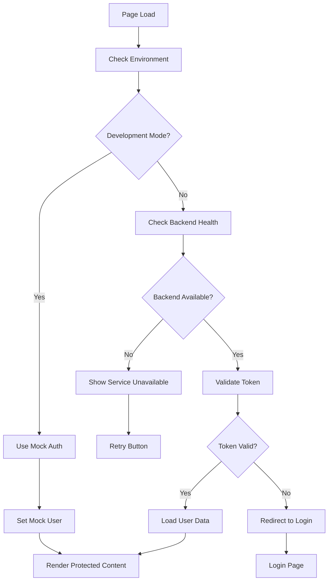

# Design Document

## Overview

This design addresses the infinite redirect authentication issue and provides a robust development experience with proper error handling and fallback mechanisms.

## Architecture

### 1. Authentication Flow Redesign



### 2. Component Error Fixes

The immediate React errors need to be addressed:

1. **Modal CSS Property Error**: Fix kebab-case CSS properties
2. **Key Prop Spreading Error**: Properly handle React keys in Autocomplete
3. **Infinite Re-render**: Fix useEffect dependency issues in useModalForm hook

## Components and Interfaces

### 1. Enhanced ProtectedRoute Component

```typescript
interface ProtectedRouteProps {
  children: React.ReactNode
  fallback?: React.ReactNode
  requireAuth?: boolean // Allow bypassing auth in development
}

interface AuthState {
  isAuthenticated: boolean
  isLoading: boolean
  isInitialized: boolean
  user: User | null
  error: string | null
  isDevelopmentMode: boolean
}
```

### 2. Development Auth Service

```typescript
interface MockAuthService {
  getMockUser(): User
  bypassAuthentication(): Promise<void>
  checkBackendHealth(): Promise<boolean>
}
```

### 3. Enhanced Error Handling

```typescript
interface AuthError {
  type: 'NETWORK' | 'INVALID_TOKEN' | 'SERVICE_UNAVAILABLE' | 'UNKNOWN'
  message: string
  retryable: boolean
}
```

## Data Models

### 1. Mock User Model

```typescript
const MOCK_USER: User = {
  id: 'dev-user-001',
  email: 'developer@localhost',
  name: 'Development User',
  role: 'admin',
  roles: ['admin', 'user', 'developer']
}
```

### 2. Environment Configuration

```typescript
interface EnvironmentConfig {
  isDevelopment: boolean
  apiUrl: string
  enableMockAuth: boolean
  backendHealthCheckUrl: string
}
```

## Error Handling

### 1. Authentication Errors

- **Network Errors**: Show retry button with backend health check
- **Invalid Token**: Clear auth state and redirect to login
- **Service Unavailable**: Show service status with retry option
- **Unknown Errors**: Show generic error with support contact

### 2. Component Errors

- **Modal Errors**: Fix CSS property naming and event handling
- **Form Errors**: Fix infinite re-render loops in useModalForm
- **Autocomplete Errors**: Properly handle key props and rendering

### 3. Graceful Degradation

- **Backend Unavailable**: Switch to mock authentication
- **Partial Service**: Show warnings but allow continued use
- **Network Issues**: Cache last known auth state

## Testing Strategy

### 1. Authentication Flow Testing

- Test with backend available/unavailable
- Test token validation scenarios
- Test development mode bypass
- Test error recovery flows

### 2. Component Error Testing

- Test Modal component with various props
- Test form submission and validation
- Test Autocomplete with different data sets
- Test infinite render prevention

### 3. Integration Testing

- Test full authentication flow
- Test page refresh scenarios
- Test network failure recovery
- Test development/production mode switching