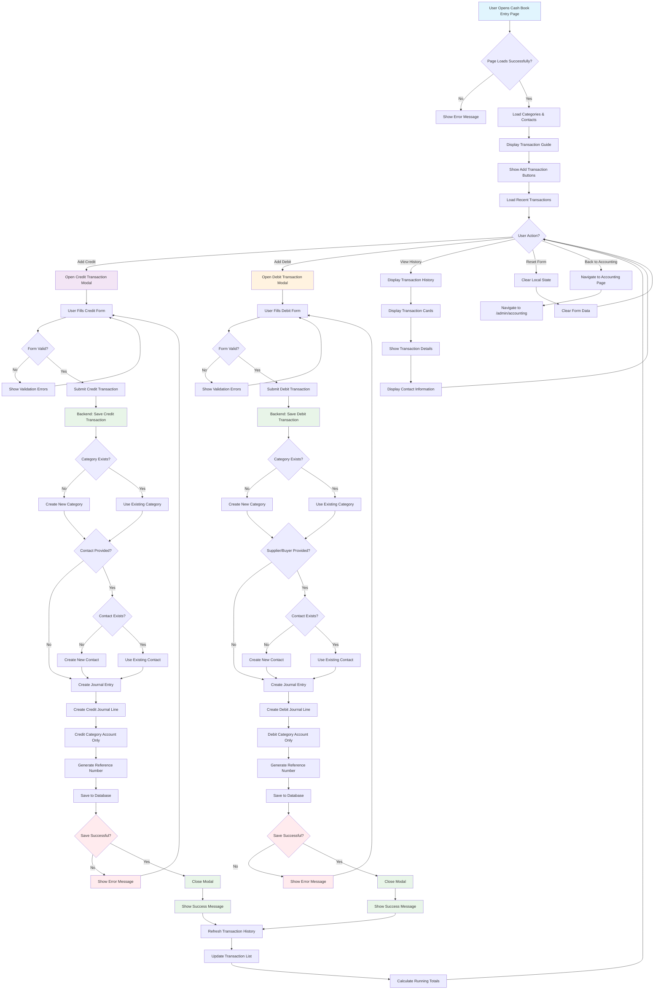

# Cash Book Entry - Independent Transactions - Flowchart Diagram

```mermaid
flowchart TD
    A[User Opens Cash Book Entry Page] --> B{Page Loads Successfully?}
    B -->|No| C[Show Error Message]
    B -->|Yes| D[Load Categories & Contacts]
    
    D --> E[Display Transaction Guide]
    E --> F[Show Add Transaction Buttons]
    F --> G[Load Recent Transactions]
    
    G --> H{User Action?}
    H -->|Add Credit| I[Open Credit Transaction Modal]
    H -->|Add Debit| J[Open Debit Transaction Modal]
    H -->|View History| K[Display Transaction History]
    H -->|Reset Form| L[Clear Local State]
    H -->|Back to Accounting| M[Navigate to Accounting Page]
    
    I --> N[User Fills Credit Form]
    N --> O{Form Valid?}
    O -->|No| P[Show Validation Errors]
    P --> N
    O -->|Yes| Q[Submit Credit Transaction]
    
    J --> R[User Fills Debit Form]
    R --> S{Form Valid?}
    S -->|No| T[Show Validation Errors]
    T --> R
    S -->|Yes| U[Submit Debit Transaction]
    
    Q --> V[Backend: Save Credit Transaction]
    U --> W[Backend: Save Debit Transaction]
    
    V --> X{Category Exists?}
    X -->|No| Y[Create New Category]
    X -->|Yes| Z[Use Existing Category]
    Y --> AA{Contact Provided?}
    Z --> AA
    
    W --> BB{Category Exists?}
    BB -->|No| CC[Create New Category]
    BB -->|Yes| DD[Use Existing Category]
    CC --> EE{Supplier/Buyer Provided?}
    DD --> EE
    
    AA -->|No| FF[Create Journal Entry]
    AA -->|Yes| GG{Contact Exists?}
    GG -->|No| HH[Create New Contact]
    GG -->|Yes| II[Use Existing Contact]
    HH --> FF
    II --> FF
    
    EE -->|No| JJ[Create Journal Entry]
    EE -->|Yes| KK{Contact Exists?}
    KK -->|No| LL[Create New Contact]
    KK -->|Yes| MM[Use Existing Contact]
    LL --> JJ
    MM --> JJ
    
    FF --> NN[Create Credit Journal Line]
    NN --> OO[Credit Category Account Only]
    OO --> QQ[Generate Reference Number]
    QQ --> RR[Save to Database]
    
    JJ --> SS[Create Debit Journal Line]
    SS --> TT[Debit Category Account Only]
    TT --> VV[Generate Reference Number]
    VV --> WW[Save to Database]
    
    RR --> XX{Save Successful?}
    WW --> YY{Save Successful?}
    
    XX -->|No| ZZ[Show Error Message]
    XX -->|Yes| AAA[Close Modal]
    AAA --> BBB[Show Success Message]
    BBB --> CCC[Refresh Transaction History]
    
    YY -->|No| DDD[Show Error Message]
    YY -->|Yes| EEE[Close Modal]
    EEE --> FFF[Show Success Message]
    FFF --> CCC
    
    ZZ --> N
    DDD --> R
    
    CCC --> GGG[Update Transaction List]
    GGG --> HHH[Calculate Running Totals]
    HHH --> H
    
    K --> III[Display Transaction Cards]
    III --> JJJ[Show Transaction Details]
    JJJ --> KKK[Display Contact Information]
    KKK --> H
    
    L --> LLL[Clear Form Data]
    LLL --> H
    
    M --> NNN[Navigate to /admin/accounting]
    
    style A fill:#e1f5fe
    style I fill:#f3e5f5
    style J fill:#fff3e0
    style V fill:#e8f5e8
    style W fill:#e8f5e8
    style XX fill:#ffebee
    style YY fill:#ffebee
    style ZZ fill:#ffebee
    style DDD fill:#ffebee
    style AAA fill:#e8f5e8
    style EEE fill:#e8f5e8
    style BBB fill:#e8f5e8
    style FFF fill:#e8f5e8
```
