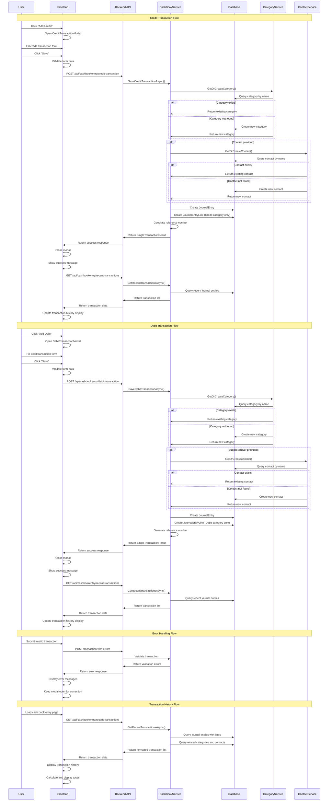

# Cash Book Entry - Independent Transactions - Sequence Diagram

```mermaid
sequenceDiagram
    participant U as User
    participant FE as Frontend
    participant API as Backend API
    participant SVC as CashBookService
    participant DB as Database
    participant CAT as CategoryService
    participant CONT as ContactService

    Note over U,CONT: Credit Transaction Flow
    U->>FE: Click "Add Credit"
    FE->>FE: Open CreditTransactionModal
    U->>FE: Fill credit transaction form
    U->>FE: Click "Save"
    FE->>FE: Validate form data
    FE->>API: POST /api/cashbookentry/credit-transaction
    API->>SVC: SaveCreditTransactionAsync()
    SVC->>CAT: GetOrCreateCategory()
    CAT->>DB: Query category by name
    alt Category exists
        CAT->>SVC: Return existing category
    else Category not found
        CAT->>DB: Create new category
        CAT->>SVC: Return new category
    end
    alt Contact provided
        SVC->>CONT: GetOrCreateContact()
        CONT->>DB: Query contact by name
        alt Contact exists
            CONT->>SVC: Return existing contact
        else Contact not found
            CONT->>DB: Create new contact
            CONT->>SVC: Return new contact
        end
    end
    SVC->>DB: Create JournalEntry
    SVC->>DB: Create JournalEntryLine (Credit category only)
    SVC->>SVC: Generate reference number
    SVC->>API: Return SingleTransactionResult
    API->>FE: Return success response
    FE->>FE: Close modal
    FE->>FE: Show success message
    FE->>API: GET /api/cashbookentry/recent-transactions
    API->>SVC: GetRecentTransactionsAsync()
    SVC->>DB: Query recent journal entries
    SVC->>API: Return transaction list
    API->>FE: Return transaction data
    FE->>FE: Update transaction history display

    Note over U,CONT: Debit Transaction Flow
    U->>FE: Click "Add Debit"
    FE->>FE: Open DebitTransactionModal
    U->>FE: Fill debit transaction form
    U->>FE: Click "Save"
    FE->>FE: Validate form data
    FE->>API: POST /api/cashbookentry/debit-transaction
    API->>SVC: SaveDebitTransactionAsync()
    SVC->>CAT: GetOrCreateCategory()
    CAT->>DB: Query category by name
    alt Category exists
        CAT->>SVC: Return existing category
    else Category not found
        CAT->>DB: Create new category
        CAT->>SVC: Return new category
    end
    alt Supplier/Buyer provided
        SVC->>CONT: GetOrCreateContact()
        CONT->>DB: Query contact by name
        alt Contact exists
            CONT->>SVC: Return existing contact
        else Contact not found
            CONT->>DB: Create new contact
            CONT->>SVC: Return new contact
        end
    end
    SVC->>DB: Create JournalEntry
    SVC->>DB: Create JournalEntryLine (Debit category only)
    SVC->>SVC: Generate reference number
    SVC->>API: Return SingleTransactionResult
    API->>FE: Return success response
    FE->>FE: Close modal
    FE->>FE: Show success message
    FE->>API: GET /api/cashbookentry/recent-transactions
    API->>SVC: GetRecentTransactionsAsync()
    SVC->>DB: Query recent journal entries
    SVC->>API: Return transaction list
    API->>FE: Return transaction data
    FE->>FE: Update transaction history display

    Note over U,CONT: Error Handling Flow
    U->>FE: Submit invalid transaction
    FE->>API: POST transaction with errors
    API->>SVC: Validate transaction
    SVC->>API: Return validation errors
    API->>FE: Return error response
    FE->>FE: Display error messages
    FE->>FE: Keep modal open for correction

    Note over U,CONT: Transaction History Flow
    U->>FE: Load cash book entry page
    FE->>API: GET /api/cashbookentry/recent-transactions
    API->>SVC: GetRecentTransactionsAsync()
    SVC->>DB: Query journal entries with lines
    SVC->>DB: Query related categories and contacts
    SVC->>API: Return formatted transaction list
    API->>FE: Return transaction data
    FE->>FE: Display transaction history
    FE->>FE: Calculate and display totals
```
