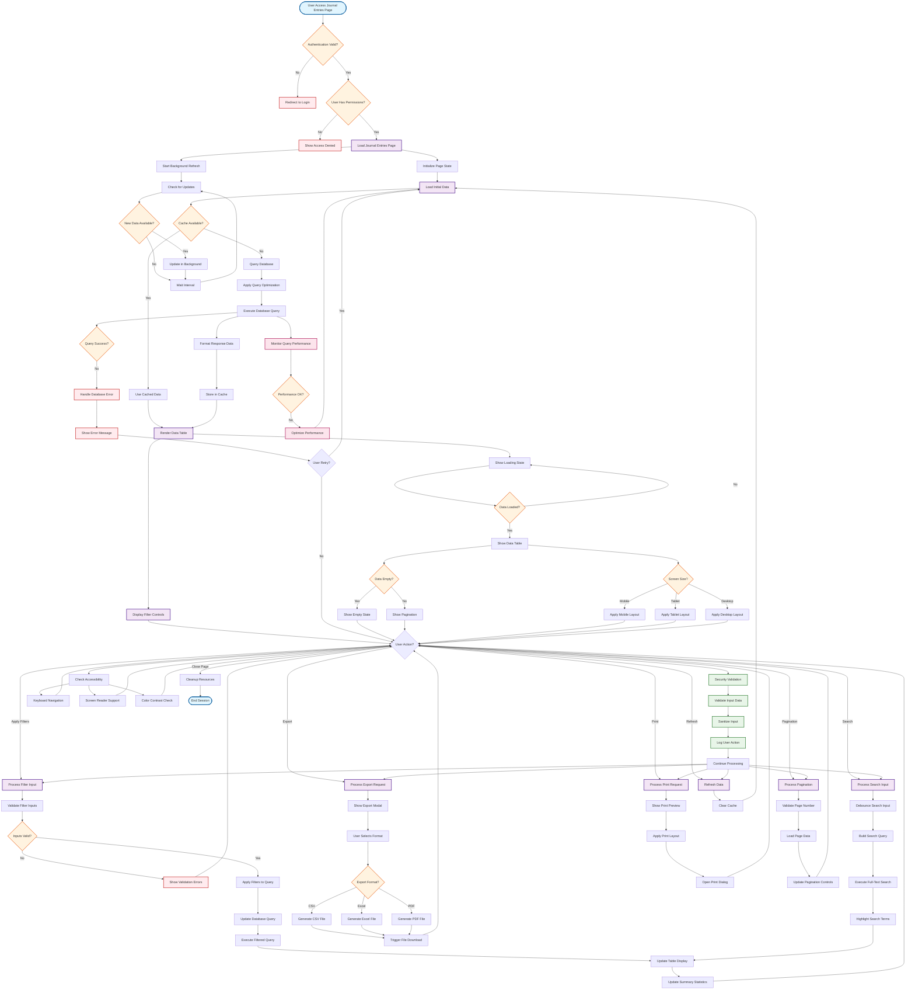

# Journal Entry Management System - Feature Flowchart Diagram

## Overall Process and Logic Flow

## Key Process Flows

### 🔐 **Authentication & Authorization Flow**
- User authentication validation
- Permission checking for journal entry access
- Security validation for all user actions

### 📊 **Data Loading & Caching Flow**
- Initial page load with cache checking
- Database query optimization and execution
- Cache management and data formatting

### 🔍 **Filtering & Search Flow**
- Filter input validation and processing
- Search with debouncing and full-text search
- Real-time table and summary updates

### 📄 **Export & Print Flow**
- Multiple format export (CSV, Excel, PDF)
- Print preview and layout handling
- File download and print dialog management

### 📱 **User Experience Flow**
- Responsive design adaptation
- Loading states and error handling
- Accessibility and keyboard navigation

### 🚀 **Performance & Security Flow**
- Performance monitoring and optimization
- Input validation and sanitization
- Audit logging and security measures

### 🔄 **Background Processes**
- Real-time data updates
- Cache management
- Performance optimization

## Decision Points

### **Authentication Decisions**
- Is user authenticated?
- Does user have required permissions?

### **Data Loading Decisions**
- Is cached data available?
- Is database query successful?
- Is performance acceptable?

### **User Input Decisions**
- Are filter inputs valid?
- What export format selected?
- What screen size is being used?

### **Error Handling Decisions**
- Should user retry failed operations?
- How to handle database errors?
- What error messages to display?

## State Management

### **Loading States**
- Initial page loading
- Data fetching
- Filter processing
- Export generation

### **Error States**
- Authentication errors
- Database errors
- Validation errors
- Network errors

### **Success States**
- Data loaded successfully
- Filters applied
- Export completed
- Print initiated
