# Journal Entry Management System - Feature Sequence Diagram

## End-to-End Workflow Sequence

```mermaid
sequenceDiagram
    participant User as 👤 User
    participant Frontend as 🖥️ Frontend (Next.js)
    participant API as 🔌 API Gateway
    participant Auth as 🔐 Authentication
    participant Controller as 🎮 JournalEntryController
    participant Service as ⚙️ JournalEntryService
    participant Cache as 🗄️ Redis Cache
    participant DB as 🗃️ PostgreSQL DB
    participant Export as 📄 Export Service

    Note over User,Export: Phase 1: User Authentication & Authorization
    User->>Frontend: Access Journal Entries Page
    Frontend->>API: GET /api/journalentries (with JWT)
    API->>Auth: Validate JWT Token
    Auth-->>API: Token Valid + User Permissions
    API->>Controller: Forward Request

    Note over User,Export: Phase 2: Initial Data Loading
    Controller->>Service: GetJournalEntriesAsync(request)
    Service->>Cache: Check Cache for Results
    alt Cache Hit
        Cache-->>Service: Return Cached Data
    else Cache Miss
        Service->>DB: Query JournalEntries with Filters
        DB-->>Service: Return Paginated Results
        Service->>Cache: Store Results in Cache
    end
    Service-->>Controller: JournalEntriesResponse
    Controller-->>API: HTTP 200 + JSON Response
    API-->>Frontend: Response with Data
    Frontend->>Frontend: Update State & Render Table

    Note over User,Export: Phase 3: Filter & Search Operations
    User->>Frontend: Apply Filters (Date, Type, Amount, etc.)
    Frontend->>Frontend: Validate Filter Inputs
    Frontend->>API: GET /api/journalentries?filters=...
    API->>Controller: Forward Filtered Request
    Controller->>Service: GetJournalEntriesAsync(filteredRequest)
    Service->>DB: Execute Filtered Query
    DB-->>Service: Filtered Results
    Service-->>Controller: Filtered Response
    Controller-->>API: HTTP 200 + Filtered Data
    API-->>Frontend: Updated Results
    Frontend->>Frontend: Update Table & Summary

    Note over User,Export: Phase 4: Search Operations
    User->>Frontend: Enter Search Term
    Frontend->>Frontend: Debounce Search Input
    Frontend->>API: GET /api/journalentries?search=...
    API->>Controller: Forward Search Request
    Controller->>Service: GetJournalEntriesAsync(searchRequest)
    Service->>DB: Full-Text Search Query
    DB-->>Service: Search Results
    Service-->>Controller: Search Response
    Controller-->>API: HTTP 200 + Search Data
    API-->>Frontend: Search Results
    Frontend->>Frontend: Highlight Search Terms

    Note over User,Export: Phase 5: Export Operations
    User->>Frontend: Click Export Button
    Frontend->>Frontend: Show Export Modal
    User->>Frontend: Select Format (CSV/Excel/PDF)
    User->>Frontend: Choose Export Options
    Frontend->>API: POST /api/journalentries/export
    API->>Controller: Forward Export Request
    Controller->>Export: Generate Export File
    Export->>Service: Get Data for Export
    Service->>DB: Query Data for Export
    DB-->>Service: Export Data
    Service-->>Export: Formatted Data
    Export->>Export: Generate File (CSV/Excel/PDF)
    Export-->>Controller: File Bytes
    Controller-->>API: HTTP 200 + File Download
    API-->>Frontend: File Download Response
    Frontend->>User: Trigger File Download

    Note over User,Export: Phase 6: Pagination & Navigation
    User->>Frontend: Click Next/Previous Page
    Frontend->>API: GET /api/journalentries?page=2
    API->>Controller: Forward Pagination Request
    Controller->>Service: GetJournalEntriesAsync(pageRequest)
    Service->>DB: Paginated Query
    DB-->>Service: Page Results
    Service-->>Controller: Paginated Response
    Controller-->>API: HTTP 200 + Page Data
    API-->>Frontend: New Page Data
    Frontend->>Frontend: Update Table & Pagination

    Note over User,Export: Phase 7: Error Handling & Recovery
    alt Database Error
        DB-->>Service: Database Error
        Service-->>Controller: Error Response
        Controller-->>API: HTTP 500 + Error Details
        API-->>Frontend: Error Response
        Frontend->>Frontend: Show Error Message
        Frontend->>User: Display Error Notification
    else Network Error
        API-->>Frontend: Network Timeout
        Frontend->>Frontend: Show Retry Button
        User->>Frontend: Click Retry
        Frontend->>API: Retry Request
    end

    Note over User,Export: Phase 8: Real-time Updates
    loop Background Refresh
        Frontend->>API: GET /api/journalentries (background)
        API->>Controller: Background Request
        Controller->>Service: GetJournalEntriesAsync
        Service->>DB: Check for New Data
        DB-->>Service: Updated Results
        Service-->>Controller: Updated Response
        Controller-->>API: HTTP 200 + Updated Data
        API-->>Frontend: Updated Results
        Frontend->>Frontend: Update if Data Changed
    end

    Note over User,Export: Phase 9: Performance Optimization
    Service->>Cache: Cache Frequently Accessed Data
    Cache-->>Service: Cache Hit for Common Queries
    Service->>DB: Optimized Queries with Indexes
    DB-->>Service: Fast Query Results
    Service-->>Controller: Optimized Response
    Controller-->>API: Compressed Response
    API-->>Frontend: Fast Response Delivery

    Note over User,Export: Phase 10: Security & Audit
    Controller->>Controller: Log User Actions
    Controller->>Controller: Validate Input Data
    Controller->>Controller: Check User Permissions
    Controller->>Controller: Sanitize Output Data
    Controller-->>API: Secure Response
    API-->>Frontend: Sanitized Data
    Frontend->>Frontend: Render Secure Content
```

## Key Workflow Phases

### 🔐 **Authentication & Authorization**
- JWT token validation
- Role-based access control
- Permission checking for journal entry access

### 📊 **Data Loading & Caching**
- Initial page load with pagination
- Redis caching for performance
- Database query optimization

### 🔍 **Filtering & Search**
- Advanced filtering (date, type, amount, category)
- Full-text search across multiple fields
- Real-time filter updates

### 📄 **Export Functionality**
- Multiple format support (CSV, Excel, PDF)
- Filtered data export
- File download handling

### 📱 **User Experience**
- Responsive design
- Loading states and error handling
- Real-time updates and background refresh

### 🚀 **Performance & Security**
- Query optimization and caching
- Input validation and sanitization
- Audit logging and security measures
