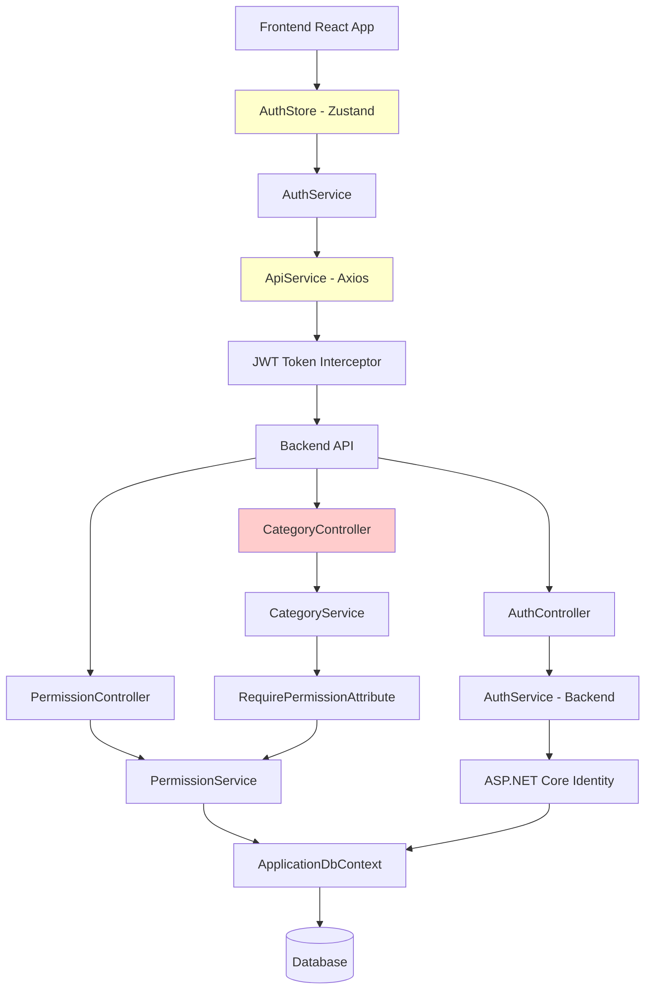
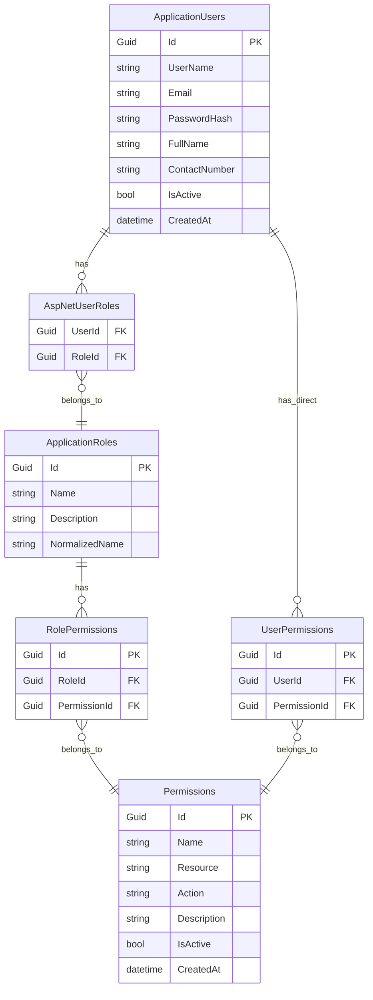

# RBAC System Enhancement Design Document

## Overview

This design document outlines the enhancements needed for the existing Role-Based Access Control (RBAC) system in the Garments ERP application. The current system has a solid foundation but requires specific fixes to eliminate redirect loops, properly assign permissions, and ensure seamless user experience.

## Architecture

### Current System Architecture



**Legend:**
- 🔴 Red: Components with issues that need fixing
- 🟡 Yellow: Components that need enhancements

### Current Database Schema (ASP.NET Core Identity)



**Note**: The database schema is already properly implemented. The issue is missing permission assignments, not schema problems.

## Issues Analysis and Solutions

### Issue 1: Category Controller Missing Permission Attributes

**Current State:**
```csharp
[Route("api/[controller]")]
[ApiController]
[Authorize] // Only basic authorization, no permission checking
public class CategoryController : ControllerBase
```

**Required Fix:**
```csharp
[Route("api/[controller]")]
[ApiController]
[Authorize]
public class CategoryController : ControllerBase
{
    [HttpGet]
    [RequirePermission("Category", "View")]
    public async Task<ActionResult<IEnumerable<CategoryDto>>> GetCategories()
    
    [HttpPost]
    [RequirePermission("Category", "Create")]
    public async Task<ActionResult<CategoryDto>> CreateCategory([FromBody] CreateCategoryRequest request)
    
    [HttpPut("{id}")]
    [RequirePermission("Category", "Update")]
    public async Task<ActionResult<CategoryDto>> UpdateCategory(Guid id, [FromBody] UpdateCategoryRequest request)
    
    [HttpDelete("{id}")]
    [RequirePermission("Category", "Delete")]
    public async Task<ActionResult> DeleteCategory(Guid id)
}
```

### Issue 2: Frontend Authentication Redirect Loops

**Current Problem:**
- AuthStore and ApiService token synchronization issues
- ProtectedRoute component timing problems
- Multiple redirects between login/dashboard/categories

**Root Cause Analysis:**
```typescript
// Current problematic flow:
1. User navigates to /admin/accounting/categories
2. ProtectedRoute checks auth state (not yet restored)
3. Redirects to /login
4. AuthInitializer restores auth state
5. User is logged in, redirects back to categories
6. API call fails with 401 (token not set in ApiService)
7. ApiService redirects to /login again
8. Infinite loop created
```

**Solution Design:**
```typescript
// Fixed flow:
1. AuthInitializer runs first and restores complete auth state
2. Token is properly set in ApiService during restoration
3. ProtectedRoute waits for auth initialization to complete
4. Navigation proceeds only after auth state is fully restored
5. API calls include proper authorization headers
```

### Issue 3: Missing Permission Assignments

**Current Problem:**
- Default roles (Admin, Manager, Employee) exist but have no permissions assigned
- Category permissions exist but are not assigned to any roles
- Users can authenticate but can't access any protected resources

**Required Permission Assignments:**
```csharp
// Default permissions that need to be created and assigned
var categoryPermissions = new[]
{
    new Permission { Resource = "Category", Action = "View", Name = "View Categories" },
    new Permission { Resource = "Category", Action = "Create", Name = "Create Categories" },
    new Permission { Resource = "Category", Action = "Update", Name = "Update Categories" },
    new Permission { Resource = "Category", Action = "Delete", Name = "Delete Categories" }
};

// Role-Permission assignments needed:
Admin Role:
- Category.View, Category.Create, Category.Update, Category.Delete
- User.View, User.Create, User.Update
- Role.View, Role.Create, Role.Update

Manager Role:
- Category.View, Category.Create, Category.Update
- User.View

Employee Role:
- Category.View
```

### Issue 4: Frontend Permission-Based UI Components

**Current Gap:**
- No permission-based UI components for conditional rendering
- All users see the same UI regardless of permissions
- No graceful handling of unauthorized access

**Required Components:**
```typescript
// Permission Guard Component
interface PermissionGuardProps {
  resource: string;
  action: string;
  children: React.ReactNode;
  fallback?: React.ReactNode;
}

// Usage in Category Management
<PermissionGuard resource="Category" action="Create">
  <Button onClick={handleCreateCategory}>Create Category</Button>
</PermissionGuard>

<PermissionGuard resource="Category" action="Delete">
  <IconButton onClick={handleDelete}>
    <DeleteIcon />
  </IconButton>
</PermissionGuard>
```

## Implementation Strategy

### Phase 1: Fix Backend Permission Assignments

1. **Create Permission Seeder Service**
   - Ensure all required permissions exist in database
   - Assign permissions to default roles
   - Handle existing data gracefully

2. **Update Category Controller**
   - Add RequirePermission attributes to all endpoints
   - Ensure proper resource-action mapping

### Phase 2: Fix Frontend Authentication Issues

1. **Enhance AuthStore**
   - Add permission and role tracking
   - Improve token synchronization with ApiService
   - Add proper initialization state management

2. **Fix ProtectedRoute Component**
   - Wait for auth initialization to complete
   - Prevent premature redirects
   - Handle edge cases properly

3. **Improve ApiService**
   - Better error handling for 401/403 responses
   - Prevent redirect loops
   - Proper token management

### Phase 3: Add Permission-Based UI Components

1. **Create Permission Guards**
   - PermissionGuard component for conditional rendering
   - RoleGuard component for role-based access
   - Integration with existing auth system

#### 2. Protected Route Component
```typescript
interface ProtectedRouteProps {
  children: React.ReactNode;
  requiredPermission?: string;
  requiredRole?: string;
  fallback?: React.ReactNode;
}
```

#### 3. Permission Guard Component
```typescript
interface PermissionGuardProps {
  permission: string;
  children: React.ReactNode;
  fallback?: React.ReactNode;
}
```

#### 4. Role Guard Component
```typescript
interface RoleGuardProps {
  role: string;
  children: React.ReactNode;
  fallback?: React.ReactNode;
}
```

## Enhanced Data Models

### Current Permission Structure (Already Implemented)
```csharp
public class Permission
{
    public Guid Id { get; set; }
    public string Name { get; set; }
    public string Resource { get; set; }  // e.g., "Category", "User"
    public string Action { get; set; }    // e.g., "View", "Create", "Update", "Delete"
    public string Description { get; set; }
    public bool IsActive { get; set; }
    public DateTime CreatedAt { get; set; }
}
```

### Required Permissions for Category Management
```csharp
var requiredPermissions = new[]
{
    new { Resource = "Category", Action = "View", Name = "View Categories", Description = "Can view category list and details" },
    new { Resource = "Category", Action = "Create", Name = "Create Categories", Description = "Can create new categories" },
    new { Resource = "Category", Action = "Update", Name = "Update Categories", Description = "Can modify existing categories" },
    new { Resource = "Category", Action = "Delete", Name = "Delete Categories", Description = "Can delete categories" },
    new { Resource = "User", Action = "View", Name = "View Users", Description = "Can view user list" },
    new { Resource = "User", Action = "Create", Name = "Create Users", Description = "Can create new users" },
    new { Resource = "User", Action = "Update", Name = "Update Users", Description = "Can modify user details" },
    new { Resource = "Role", Action = "View", Name = "View Roles", Description = "Can view role list" },
    new { Resource = "Role", Action = "Update", Name = "Update Roles", Description = "Can modify role permissions" }
};
```

### Enhanced Frontend Auth Store
```typescript
interface AuthState {
  user: User | null;
  token: string | null;
  permissions: string[]; // New: track user permissions
  roles: string[];
  isAuthenticated: boolean;
  isLoading: boolean;
  isInitialized: boolean; // New: track initialization state
  
  // Enhanced methods
  login: (user: User, token: string) => Promise<void>;
  logout: () => void;
  updateUser: (user: Partial<User>) => void;
  checkAuth: () => Promise<void>; // Enhanced to be async
  hasPermission: (resource: string, action: string) => boolean; // New
  hasRole: (role: string) => boolean; // New
  loadUserPermissions: () => Promise<void>; // New
}

// Enhanced User interface
interface User {
  id: string;
  email: string;
  name: string;
  role: string;
  roles?: string[];
  permissions?: Permission[]; // New: include user's effective permissions
}

interface Permission {
  id: string;
  name: string;
  resource: string;
  action: string;
  description: string;
}
```

## Error Handling

### Authentication Errors
- **401 Unauthorized**: Invalid or expired token
- **403 Forbidden**: Valid token but insufficient permissions
- **429 Too Many Requests**: Rate limiting for login attempts

### Error Response Format
```typescript
interface ErrorResponse {
  success: false;
  error: {
    code: string;
    message: string;
    details?: any;
  };
  timestamp: string;
}
```

### Frontend Error Handling
```typescript
// Centralized error handling for auth-related errors
const handleAuthError = (error: ApiError) => {
  switch (error.status) {
    case 401:
      // Clear auth state and redirect to login
      authStore.logout();
      router.push('/login');
      break;
    case 403:
      // Show access denied message
      showNotification('Access denied', 'error');
      break;
    default:
      showNotification('An error occurred', 'error');
  }
};
```

## Testing Strategy

### Unit Tests
- Authentication service methods
- Authorization logic
- Permission checking functions
- Role assignment/removal
- Token validation

### Integration Tests
- Login/logout flow
- API endpoint protection
- Permission middleware
- Role-based access scenarios

### End-to-End Tests
- Complete user authentication journey
- Role-based navigation
- Permission-based UI rendering
- Admin panel functionality

### Security Tests
- Token expiration handling
- Permission bypass attempts
- SQL injection in auth queries
- Cross-site scripting (XSS) prevention
- Cross-site request forgery (CSRF) protection

## Security Considerations

### Token Security
- JWT tokens with short expiration (15 minutes)
- Refresh tokens with longer expiration (7 days)
- Secure HTTP-only cookies for refresh tokens
- Token blacklisting on logout

### Password Security
- BCrypt hashing with salt rounds ≥ 12
- Password complexity requirements
- Account lockout after failed attempts
- Password reset with secure tokens

### API Security
- Rate limiting on authentication endpoints
- CORS configuration
- Request validation and sanitization
- Audit logging for security events

### Session Management
- Automatic token refresh
- Concurrent session limits
- Session invalidation on role changes
- Secure session storage

## Performance Considerations

### Caching Strategy
- Cache user permissions in memory
- Cache role definitions
- Redis for session storage
- Database query optimization

### Database Optimization
- Indexes on frequently queried columns
- Efficient permission checking queries
- Connection pooling
- Query result caching

### Frontend Optimization
- Lazy loading of admin components
- Memoization of permission checks
- Efficient re-rendering on auth state changes
- Service worker for offline auth state